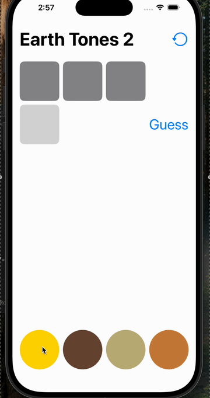
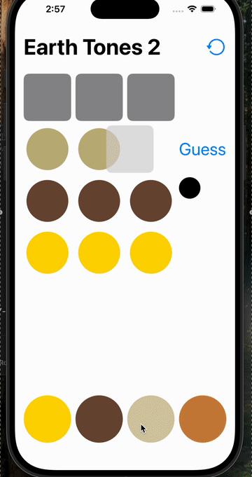

# CodeBreaker

A native SwiftUI Mastermind clone, built as a coursework project (Stanford CS193p-style problem set structure) and extended with custom features on top of the base assignment.

**Status: work in progress.** The core game loop is playable, but this isn't a finished, polished app — expect rough edges.

## Demo





## What's here

- Classic Mastermind gameplay: guess a hidden code, get peg-match feedback, repeat until solved.
- 20+ selectable themes beyond plain colors — emoji sets (vehicles, faces, animals, flags) as well as classic color pegs, randomly picked each game.
- Custom animated restart button (spin transition) and themed transitions between rounds.

## Structure

```
CodeBreaker/
├── Model/
│   ├── Code.swift          # a code (master, guess, or attempt) and its peg-match logic
│   └── CodeBreaker.swift   # game state: attempts, themes, guess/attempt flow
├── UI/
│   ├── CodeBreakerView.swift  # main game screen
│   ├── CodeView.swift
│   ├── PegView.swift
│   ├── PegChooser.swift
│   └── UIExtensions.swift     # shared animation/transition definitions
└── CodeBreakerApp.swift
```

## Known gaps / what's left

- No difficulty settings (fixed peg count / attempt limit).
- No persistence — progress resets on relaunch.
- Limited feedback UI polish compared to the color/emoji peg selection screen.

## Running it

Open in Xcode (SwiftUI, iOS/macOS target) and run. No external dependencies.
